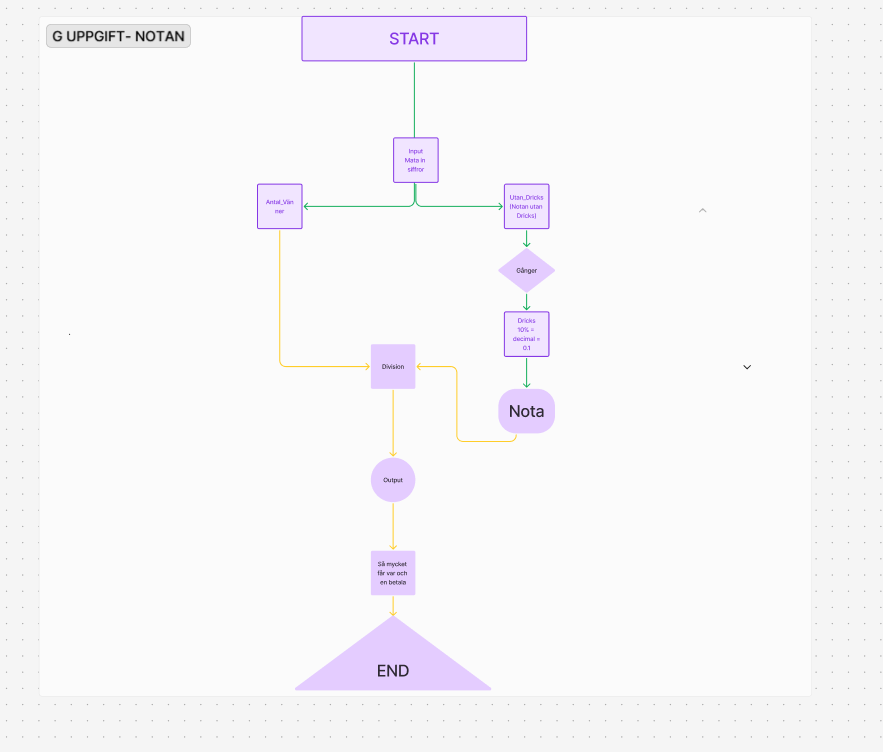
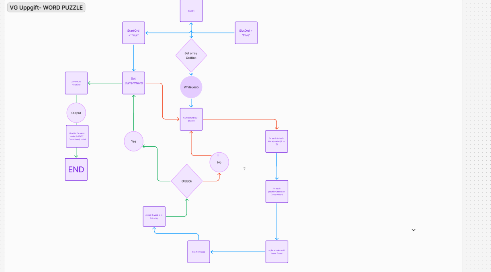

## Exam-Pseudo- Robin olsson


 `` // G-Version Split the nota`` 

``` 
Instructions:

Split the nota räknar ut hur mycket varje vän ska betala på exempelvis en restaurang när notan kommer. Användaren matar in summan, antal vänner och sedan dricks (som skrivs i decimalform d.v.s 10% blir 0.10). Skisserna nedan är mest för att ge visuell bild av hur det ser ut, ni behöver inte ha med sådant som "byt vy" eller liknande i er pseudokod.

hur det funkar:
Utan_Dricks = summan utan dricks
Dricks= antal extra summa i procent (decimal)
antal_vänner = antal vänner som skall dela på notan

START

Notan = Utan_Dricks * Dricks

Delad_summa = Nota/antal_vänner

console.log(Varje vänn betalar delad summa utav Notan)


END


``` 

 `` // VG-Version`` 
 
``` 
 Instruktioner
Pusslet går ut på att du får ett startord och ett slutord och du ska genom att byta ut bokstäver i ditt startord få det till ditt slutord med så få byten som möjligt.

Regler

Du får enbart byta ut en bokstav åt gången.
Varje ord som bildas måste vara ett korrekt engelskt ord, dvs. det måste finnas i variabeln vid namn ordbok.
Exempel

I detta exempel så ska vi få FOUR att bli FIVE. Observera att själva spelet är på engelska.

FOUR (startord)
FOUL (Bytte ut R till L)
FOOL (Bytte ut U till O)
FOOT (Bytte ut L till T)
FORT (Bytte ut O till R)
FORE (Bytte ut T till E)
FIRE (Bytte ut O till I)
FIVE (Slutord)

R,L
U,O
L,T,
O,R,
T,e,
O,I


 SETUP
 Set Array Ordbok = {FOUR, FOUL, FOOL, FOOT, FORT, FORE, FIRE, FIVE}
 CurrentWord = "Four" and SlutOrd = "Five".

START
//WHILE LOOP//
While CurrentWord is not SlutOrd;
 FOR i FROM 1 TO the LENGTH of CurrentWord - 1: // Börja från position 1
   FOR Every Letter in alfabetet from 'A' to 'Z':
    Replace Letter on index (1) i CurrentWord with bokstav
    SET New_Word = The newly found word
   

    If new word is in the OrdBok and is not the CurrentWord
       SET New_Word to the CurrentWord
       console.log("The word is CurrentWord and is in the OrdBok)
       Break // eller inte om du vill forsätta utan att starta om manuellt.

    
    Else
    //go back to the next letter in the alfabetet
    Continue.
       

//Medelandet är utanför loopen vilket menas med att slut ordet har hittats!
Console.log("You did it Jesper, gratz! sorry för svengelskan GODJUL och GottNyttÅR!")
END

      


``` 
# Figma Screens
# G 
# VG: 
# FigJam-FlowChart 
[FigJam-länk](https://www.figma.com/board/4XlI7H7LYmVJgLRe3YyqPS/Untitled?node-id=4-115&t=JZrQiQI2StqDKHVT-1) 
#

